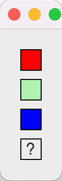

# Color selection button for PyQt
Button displays selected color and popup a color selection dialog.

<!-- - [Quick start example](#quick-start-example) -->

## Quick start example
Source code: [ColorButtonExample.py](../examples/ColorButtonExample.py)

```python
from qtpy.QtWidgets import QApplication, QWidget, QVBoxLayout
from qtpy.QtGui import QColor
from pyqt_ext.widgets import ColorButton

# Create the application
app = QApplication()

# Create some color buttons
redButton = ColorButton('red')
transparentGreenButton = ColorButton([0, 255, 0, 64])
blueButton = ColorButton([0.0, 0.0, 1.0])
noColorButton = ColorButton()

# Print the color when it changes
redButton.colorChanged.connect(print)
transparentGreenButton.colorChanged.connect(print)
blueButton.colorChanged.connect(print)
noColorButton.colorChanged.connect(print)

# Array of color buttons
ui = QWidget()
vbox = QVBoxLayout(ui)
vbox.addWidget(redButton)
vbox.addWidget(transparentGreenButton)
vbox.addWidget(blueButton)
vbox.addWidget(noColorButton)
ui.show()

# Run the application
app.exec()

print('Final color selections:')
print(f'red -> {redButton.color()}')
print(f'transparentGreen -> {transparentGreenButton.color()}')
print(f'blue -> {blueButton.color()}')
print(f'noColor -> {noColorButton.color()}')
```

And voila! Try selecting new colors...

