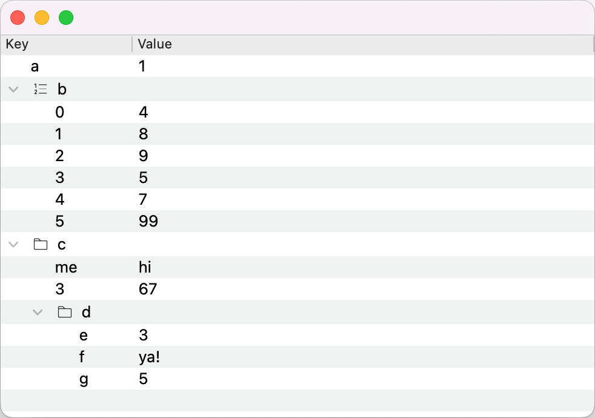

# Key-Value tree model/view interface for PyQt
Model/View implementation of a tree of (key, value) pairs that builds off of [abstract tree model/view interface](AbstractTree.md).

# Table of contents
- [Install](#install)
- [Quick start example](#quick-start-example)
- [KeyValueTreeItem](#keyvaluetreeitem): AbstractTreeItem with *key*, *value* data.
- [KeyValueTreeModel](#keyvaluetreemodel): Tree model that knows how to work with `KeyValueTreeItem`s.
- [KeyValueDndTreeModel](#keyvaluedndtreemodel): Tree model with default drag-and-drop functionality.
- [KeyValueTreeView](#keyvaluetreeview): Tree view widget with context menu and Ctrl+Wheel expand/fold.

# Install
Should work with PySide6, PyQt6, or PyQt5.
```shell
pip install PySide6 pyqt-ext
```

# Quick start example
Source code: [KeyValueTreeExample.py](../examples/KeyValueTreeExample.py)

Create the application...
```python
# should work with PySide6, PyQt6, or PyQt5
from PySide6.QtWidgets import QApplicaiton
app = QApplicaiton()
```

Build the tree from some JSON-serializable data...
```python
from pyqt_ext.tree import KeyValueTreeItem

data = {
    'a': 1,
    'b': [4, 8, 9, 5, 7, 99],
    'c': {
        'me': 'hi',
        3: 67,
        'd': {
            'e': 3,
            'f': 'ya!',
            'g': 5,
        },
    },
}

root = KeyValueTreeItem(key='/', value=data)
print(root)
```
```shell
/
├── a: 1
├── b
│   ├── 0: 4
│   ├── 1: 8
│   ├── 2: 9
│   ├── 3: 5
│   ├── 4: 7
│   └── 5: 99
└── c
    ├── me: hi
    ├── 3: 67
    └── d
        ├── e: 3
        ├── f: ya!
        └── g: 5
```

Create the tree model (with drag-and-drop)...
```python
from pyqt_ext.tree import KeyValueDndTreeModel

model = KeyValueDndTreeModel(root)
```

Create the tree view widget...
```python
from pyqt_ext.tree import KeyValueTreeView

view = KeyValueTreeView()
view.setModel(model)
view.expandAll()
view.resizeAllColumnsToContents()
view.show()
```

Run the application...
```python
app.exec()
```

And voila! Try editing the data, using the context menu to insert/delete items, and dragging the items to rearrange the tree (note that this will also rearrange the mapped JSON-serializable `data`)...



# KeyValueTreeItem
Source code: [KeyValueTreeItem.py](../src/pyqt_ext/tree/KeyValueTreeItem.py)

`KeyValueTreeItem` provides an `AbstractTreeItem` with `key` and `value` properties for a tree with two columns: *key*, *value*.

# KeyValueTreeModel
Source code: [KeyValueTreeModel.py](../src/pyqt_ext/tree/KeyValueTreeModel.py)

`KeyValueTreeModel` provides a `AbstractTreeModel` interface for a tree of `KeyValueTreeItem`s with two columns: *key*, *value*.

# KeyValueDndTreeModel
Source code: [KeyValueDndTreeModel.py](../src/pyqt_ext/tree/KeyValueDndTreeModel.py)

Same as `KeyValueTreeModel` except that drag-and-drop is enabled (`supportedDropActions` allows `MoveAction` and `CopyAction` by default).

# KeyValueTreeView
Source code: [KeyValueTreeView.py](../src/pyqt_ext/tree/KeyValueTreeView.py)

`KeyValueTreeView` provides a `TreeView` interface for a tree of `KeyValueTreeItem`s. Context menu allows inserting/deleting items.
