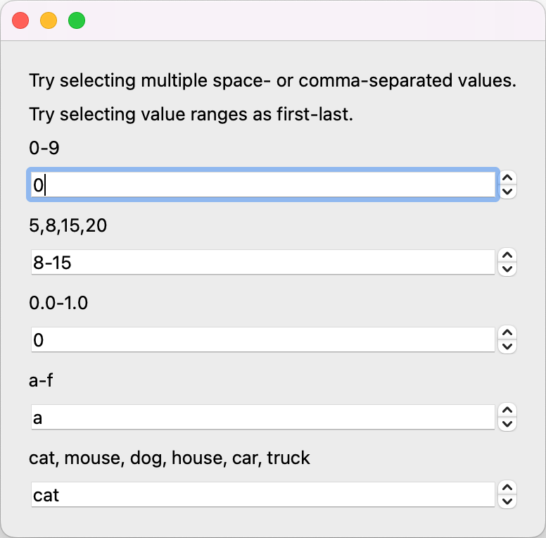

# Multi-value spinbox for PyQt

# Table of contents
- [Install](#install)
- [Quick start example](#quick-start-example)

# Install
Should work with PySide6, PyQt6, or PyQt5.
```shell
pip install PySide6 pyqt-ext
```

# Quick start example
Source code: [MultiValueSpinBoxExample.py](../examples/MultiValueSpinBoxExample.py)

```python
from qtpy.QtWidgets import QApplication, QWidget, QVBoxLayout, QLabel
from pyqt_ext.widgets import MultiValueSpinBox
import numpy as np

def print_indices_and_values(spinbox: MultiValueSpinBox):
    print('indices:', spinbox.indices())
    print('selected_values:', spinbox.selectedValues())

# Create the application
app = QApplication()

# Create a panel of multi-value spinboxes
ui = QWidget()
vbox = QVBoxLayout(ui)

vbox.addWidget(QLabel('Try selecting multiple space- or comma-separated values.'))
vbox.addWidget(QLabel('Try selecting value ranges as first-last.'))
vbox.addStretch()

spinbox = MultiValueSpinBox()
spinbox.setIndexedValues(list(range(10)))
spinbox.indicesChanged.connect(lambda obj=spinbox: print_indices_and_values(obj))
vbox.addWidget(QLabel('0-9'))
vbox.addWidget(spinbox)
vbox.addStretch()

spinbox = MultiValueSpinBox()
spinbox.setIndexedValues([5,8,15,20])
spinbox.setIndices([1,2])
spinbox.indicesChanged.connect(lambda obj=spinbox: print_indices_and_values(obj))
vbox.addWidget(QLabel('5,8,15,20'))
vbox.addWidget(spinbox)
vbox.addStretch()

spinbox = MultiValueSpinBox()
spinbox.setIndexedValues(np.linspace(0,1,11))
spinbox.indicesChanged.connect(lambda obj=spinbox: print_indices_and_values(obj))
vbox.addWidget(QLabel('0.0-1.0'))
vbox.addWidget(spinbox)
vbox.addStretch()

spinbox = MultiValueSpinBox()
spinbox.setIndexedValues(['a','b','c','d','e','f'])
spinbox.indicesChanged.connect(lambda obj=spinbox: print_indices_and_values(obj))
vbox.addWidget(QLabel('a-f'))
vbox.addWidget(spinbox)
vbox.addStretch()

spinbox = MultiValueSpinBox()
spinbox.setIndexedValues(['cat','mouse','dog','house','car','truck'])
spinbox.indicesChanged.connect(lambda obj=spinbox: print_indices_and_values(obj))
vbox.addWidget(QLabel('cat, mouse, dog, house, car, truck'))
vbox.addWidget(spinbox)
vbox.addStretch()

ui.show()

# Run the application
app.exec()
```

And voila! Try selecting single or multiple indexes...

